# 总结

[项目构想](#1)

[技术选型](#2)

[项目后端具体实现](#3)

[项目改进日志(⭐⭐⭐⭐⭐)](#4)

# 1.项目构想

## 1.维基百科介绍

中国铁路客户服务中心，俗称12306网站，是中国国家铁路集团有限公司下属的信息服务网站，基于中国铁道科学研究院所设计的“铁路客票发售及预订系统”创建。

## 2.中国铁路在线购票网站介绍

众所周知，12306是我国的主要铁路在线购票网站，一般情况下，我们购买火车票时会选择下载12306手机客户端。此外，国家也通过12306平台向在校大学生提供上学和返校时乘车的半价优惠政策。近年来，随着春运、寒暑假期和外出打工等原因，在中国的13亿人口中每天都有无数人通过12306网站购买火车票。12306网站不仅能够及时响应需求，还能保障数据的安全，这个项目毫无疑问是非常强大和可靠的。

## 3.关于12307

因此，我决定以12306为灵感，打造自己的铁路购票项目——12307在线售票项目!

# 2.技术选型

## 1.编程语言

近年来，随着互联网的蓬勃发展，各大编程语言都以令人惊叹的速度迅猛发展。在这众多编程语言中，Java毫无疑问承载着沉甸甸的期望。Java凭借其完善的生态系统和简洁的语法，赢得了广泛的喜爱，不仅在服务端表现出色，也在移动端和PC端大放异彩。作为服务端主要编程语言，它在高并发项目无疑是得到了行业内人士的高度肯定，因此，我们选择Java语言来完成12307项目。

## 2.微服务框架

大型互联网项目的尽头是微服务，但与编程语言不同的是，开源的微服务框架并不多，SpringCloud与Dubbo是我们为数不多的选择。Dubbo是阿里巴巴公司的一款RPC远程过程调用工具，集成与SpringCloud，但Dubbo从3.0开始已经不再与 Spring CloudAlibaba进行集成，Dubbo的日益壮大，使得它可以和SpringCloud平起平坐。我们这个项目选择Dubbo为我们的微服务框架，Dubbo内置优秀的RPC用它作为12307项目的“骨架”无疑是最优选。

>
SpringFramework诞生于2002年，在那个编程语言刚刚兴起的年代，Java语言的SpringFramework无疑是带给Java一个“春天”，使得Java在众多编程语言中优势更明显，多年来，Spring的发展越发势不可挡，之后更是推出了微服务解决方案——SpringCloud，而后来SpringCloud的开发依赖的更多的却是Netflix公司的库与工具，但是近些年来中国的阿里巴巴公司对SpringCloud代码贡献无疑是使得SpringCloud更方便使用，而SpringCloudAlibaba的诞生，无疑又是一个里程碑。

## 3.数据库

我们选择MySQL数据库作为数据存储引擎，MySQL是一个流行的开源关系型数据库管理系统，它的低成本、高性能、可扩展性、活跃社区、完整的ACID等等优点，无疑和本项目需求非常契合。

## 4.中间件

中间件的选择比较繁杂，本次选择的是：缓存中间件——Redis、消息中间件——RabbitMQ。

## 5.前端框架

前端框架选择使用vue3，vue是目前前端比较受欢迎的框架。

## 6.其他选择

除了以上选择，我们还使用了Java框架：MyBatis，前端库：ElementUI，web服务器：nginx，容器技术：Docker，以及Git版本控制工具、GitHub代码托管平台。

# 3.项目后端具体实现

## 1.项目地址

https://github.com/Review7872/OnlineTicketSales_Plus.git

## 2.项目功能

用户：创建账户，上传头像，修改密码，实名制，接触实名，查询车票，购买车票（需实名），退购车票（需实名），改签车票（需实名），根据实名查询自己的记录（需实名），站点查询，微信支付退款

管理员：用户一切功能，增加车次，查询车次记录，火车到站，设置火车到站时间

## 3.具体实现思路

对车票的订购必须通过身份证号完成，这样可以使得管理员在用户没有账号的情况下实现为用户购票的功能，只有特别权限管理员才可以添加车次。

用户自己购票需要注册账号，必须绑定手机号、身份证号，用户查询订单也是查询所绑定身份证号订单。

用户每次下订单，我们会给用户发送短信通知，以此达到用户确认订单以及提醒用户的功能。

## 4.数据库设计

用户数据库：用于存储用户信息，包括用户的个人资料、身份验证信息（如用户名和密码）、联系信息等。这个数据库可以支持用户注册、登录、个人资料管理等功能。

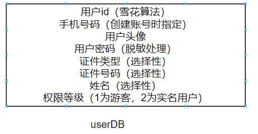

订单数据库：用于存储用户的订单信息，包括订票信息、车次、座位、支付状态等。这个数据库可以支持订单创建、修改、查询和支付等功能。

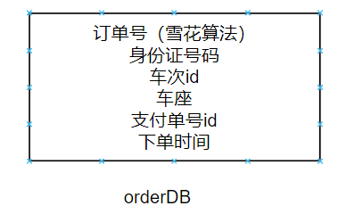

​    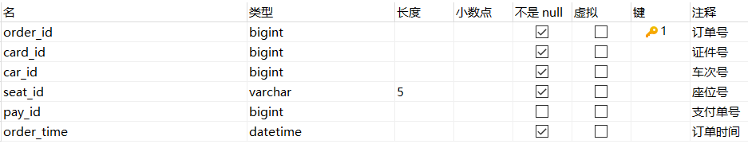

车次：用于存储火车车次息，包括车次时间表、站点信息、座位类型、价格等。这个数据库可以支持查询车次和票价计算等功能。

站点和路线数据库：用于存储火车站点和路线的信息，包括站点名称、站点位置、站点连接关系等。这个数据库可以支持查询车次路线和站点信息的功能。

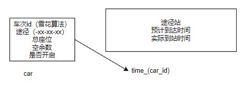

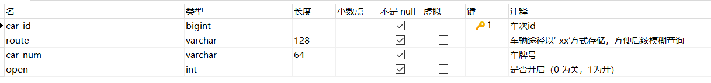

支付数据库：用于处理支付交易的数据，包括支付记录、支付方式、支付状态等。这个数据库可以支持支付处理、订单支付状态更新等功能。

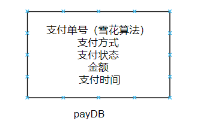

​    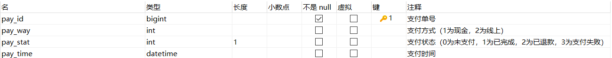

短信通知数据库, 我们将对用户部分自主行为进行短信通知与记录。

## 5.JDBC组件E-R图

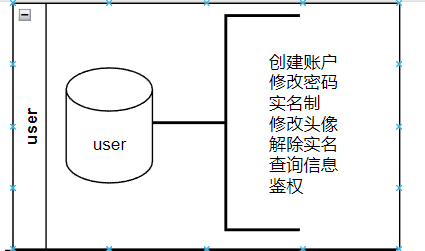

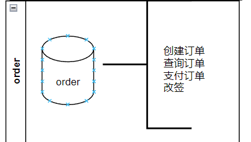

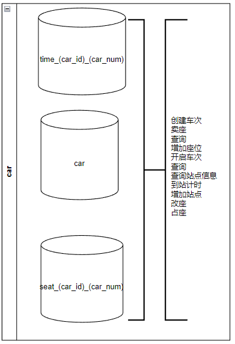

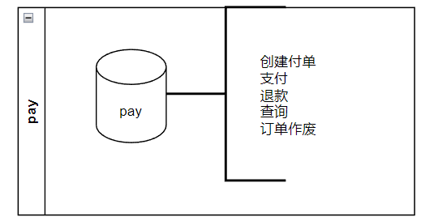

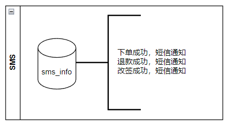

## 6.组件合并

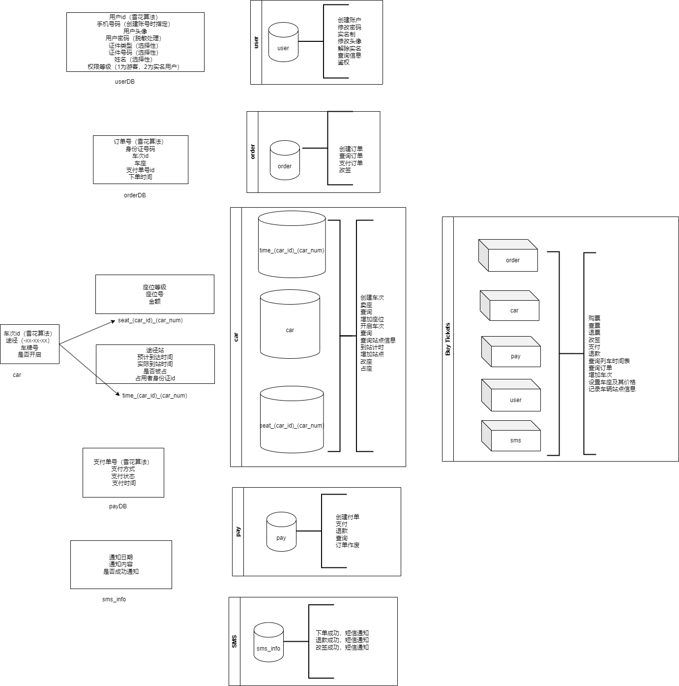

# 4.项目改进日志

## 1.Redis存储关键信息的事务问题与分布式锁导致的性能瓶颈

由于每个列车都有不同数量的站点、不同类型的座位、不同数量的座位，所有我几乎无法使用MySQL这种简单的关系数据库来存储座位信息，我想到的一种方法是将信息写入一个类，如何将类序列化后存储，如果将此信息存入MySQL数据库，那么数据库查询压力就会很大，因此我决定将信息存储于Redis中。使用Hash类型村粗，以车次id作为key，以站点作为field，将每个站点的座位信息作为value存储。

为了保证数据安全，我想自定义Redis操作的回滚操作，结果找了很久资料也没有相关资料可以将AOP事务加入注解式事务中一起一起提交一起回滚，之后我打算全部使用AOP事务，于是我回头复习了Spring事务管理器，我可能是学糊涂了，数据库事务一起提交一起回滚靠的是使用同一个Connection数据库连接对象，Redis根本用不上。

再三思索，我决定先缓存再更改，如果有异常就将缓存进行覆盖，再将异常抛出，初步解决了MySQL+Redis的事务安全问题。在拿到分布式读写锁后，如果是读锁便先缓存数据再进行操作。

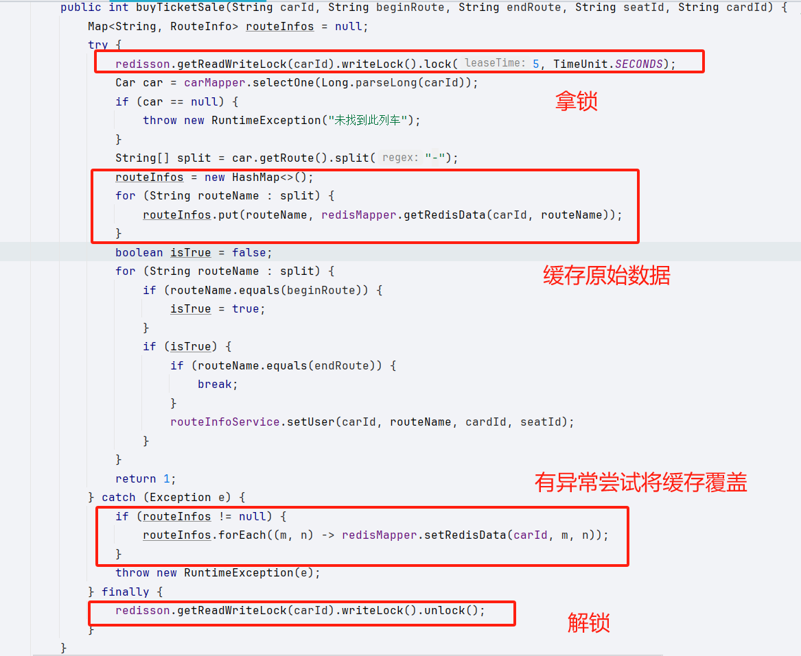

加入分布式读写锁，用一个常量作为锁的对象可以在业务层面显示修改的并发操作从而保证数据安全。但是使用分布式读写锁后，不得不考虑的是在分布式多实例情况下的性能瓶颈，毕竟这么多实例只有一个能更改数据，当我们车次变多时，性能会严重被限制。

经过一番思考，我决定使用车次id作为锁的对象，这样便由多实例只能一个修改Redis数据变成了每个车次最多只能被单个实例修改，大大提高了Redis作为数据库存储数据的性能问题。

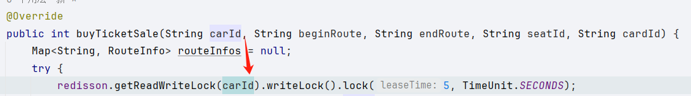

## 2.判断用户名是否重复

起初我将这个业务逻辑直连到MySQL数据库中，当用户输入框每次变动都判断一次，我担心这会使得数据库压力很大，便移到了Redis中，我使用最终一致性解决方案，在每次用户注册后将用户名使用MQ消息存储到Redis的Set型数据结构中，虽然不能保证数据的实时一致性，不过用户名保证数据一致性意义不大。
